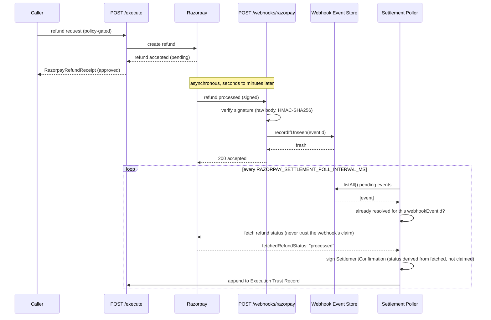

<Info>**[AVAILABLE]**, `packages/shared/src/domain/settlement-confirmation.ts`, `packages/api/src/webhooks/RazorpaySettlementProcessor.ts`, `packages/crypto/src/SettlementConfirmationCrypto.ts`. Scoped to the Razorpay refund lifecycle today, not a general-purpose settlement primitive for other connectors.</Info>

## What it is

An [Execution Trust Record](/concepts/execution-trust-records) records that an action was
authorized and executed. For most connectors that's the end of the story, the connector's
response is the outcome. A refund is different: Razorpay accepting a refund-create call
doesn't mean the refund actually settled, it means Razorpay is going to try. What actually
happened arrives later, asynchronously, as a webhook. `SettlementConfirmation` is the signed
record that closes that gap: it's appended to the original Trust Record once the outcome is
independently confirmed, never replacing or mutating anything that came before it.

```typescript
enum SettlementStatus {
  SETTLED = "SETTLED",
  SETTLEMENT_FAILED = "SETTLEMENT_FAILED",
}

interface SettlementConfirmation {
  readonly confirmationId: string;
  readonly businessTransactionId: string;
  readonly receiptId?: string;
  readonly webhookEventId: string;      // the delivery that triggered this confirmation
  readonly razorpayRefundId: string;
  readonly status: SettlementStatus;    // derived from fetchedRefundStatus, never the webhook's own claim
  readonly fetchedRefundStatus: string; // exactly as fetched from Razorpay, e.g. "processed"
  readonly confirmationHash: string;
  readonly signature: string;
  readonly algorithm: string;
  readonly issuedAt: Date;
}
```

## Fetch-verify, not trust-the-webhook

This is the load-bearing design decision. A webhook is treated strictly as a doorbell, never
a delivery. `RazorpaySettlementProcessor` never derives `status` from the webhook payload's
own claimed event type (`refund.processed` vs `refund.failed`), it uses the webhook only to
learn that *something* changed, then independently calls Razorpay's own refund-fetch API to
learn what actually changed:

```
status = fetchedRefundStatus === "processed" ? SETTLED : SETTLEMENT_FAILED
```

A forged or replayed webhook claiming `refund.processed` cannot produce a `SETTLED`
confirmation on its own, the fetched status from Razorpay always wins.

## The full lifecycle



## What triggers it, step by step

1. The settlement poller drains the webhook event store on an interval
   (`RAZORPAY_SETTLEMENT_POLL_INTERVAL_MS`, default `15000` ms), acting only on
   `refund.processed` and `refund.failed` events, everything else is stored but ignored.
2. It extracts the Razorpay refund id and the original `businessTransactionId` (carried in
   the refund's own `notes["parmana_txn"]` field, set at refund-creation time), then looks up
   the matching Execution Trust Record.
3. **If the Trust Record isn't found yet** (a webhook can arrive before the local record is
   fully committed), the event is parked with bounded retry, default five attempts, not
   dropped and not treated as an error.
4. **Durable idempotency check.** If a `SettlementConfirmation` already references this exact
   `webhookEventId`, processing stops, nothing is signed twice for the same delivery.
5. **Fetch-verify.** The processor calls Razorpay's `razorpay:refund-fetch` capability against
   the real refund, never the webhook's own payload, to learn the authoritative status. A
   fetch failure parks the event for retry rather than failing the confirmation.
6. **Sign.** `SettlementConfirmationCrypto` computes a hash over the confirmation fields,
   signs it with the same local PEM key and algorithm a Receipt is signed with (Ed25519 in
   the current single-provider configuration, see [Choose a signature
   provider](/guides/choose-a-signature-provider)), and appends the result to the Trust
   Record. Append-only, the original record is never mutated.

## Reading a confirmation back

```
GET /verification/{businessTransactionId}
```

surfaces the latest confirmation's status, id, fetched status, and refund id.

```
GET /trust-records/{businessTransactionId}
```

surfaces the full `settlementConfirmations` array, every confirmation ever appended, not just
the latest.

## Example

```json
{
  "confirmationId": "2ce80f51-9002-6729-cd50-508868979c00",
  "businessTransactionId": "eed2a972-1bf5-4166-8472-761f76fbf1b2",
  "receiptId": "3073a598-f927-4caf-8bb8-4f083f62b7e9",
  "webhookEventId": "evt_JXyz1234567890",
  "razorpayRefundId": "rfnd_ABC123",
  "status": "SETTLED",
  "fetchedRefundStatus": "processed",
  "confirmationHash": "bb9aef83d595202ec02bb338ac00461abec0541098ea065f965b5cde342d3b27",
  "algorithm": "ed25519",
  "signature": "cD8xkBuJhoy/2BdiR1x02KYZqMtKJu39olRJdzM5veSo9nYmoNSYQnt9HELlb2jlGWf07jPhP8ZXlrQnN4KQBA==",
  "issuedAt": "2026-07-18T20:05:00.000Z"
}
```

Taken directly from `schemas/common/settlement-confirmation.schema.json`'s own example.
`receiptId` is optional, present when the original approval produced one.

## Key custody, stated plainly

The signing key is a local PEM file read by `FileKeyProvider`, the same mechanism and the
same exposure noted on [Security](/security/overview). No KMS, HSM, or cloud key vault
integration exists for this signature, that's tracked as [ROADMAP] on the same page.

## What's proven where

The full lifecycle above (refund, mocked webhook, poll, `SETTLED` confirmation, read back via
`GET /verification`) runs against `MockRazorpayServer` on every `npm test`, no gate required.
The identical lifecycle against real Razorpay infrastructure, a real webhook delivery and a
real fetch-verify round trip, has been run once, manually, in both Razorpay test mode and live
mode. See [Razorpay](/integrations/razorpay#whats-proven-where-precisely) for the exact scope
of each claim.

## Next

<CardGroup cols={2}>
  <Card title="Verify Razorpay webhooks" icon="webhook" href="/guides/verify-razorpay-webhooks">
    How the webhook that triggers this gets authenticated in the first place.
  </Card>
  <Card title="Razorpay" icon="credit-card" href="/integrations/razorpay">
    The connector and policy this lifecycle closes out.
  </Card>
</CardGroup>
